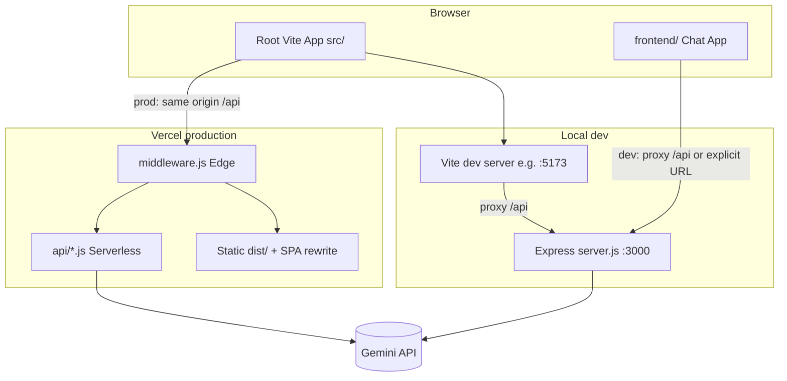

# GEO-PR-Lite (SEO / GEO Optimization Toolkit)

This repository is a **single full-stack project**: a **React (Vite)** dashboard for agencies and marketers, backed by a **Node.js (Express)** API in local development and **Vercel serverless functions** in production. **Google Gemini** powers AI features (schema generation, copy optimization, service catalog extraction, and a separate chat UI).

---

## Table of contents

1. [What this app does](#what-this-app-does)
2. [High-level architecture](#high-level-architecture)
3. [Repository layout](#repository-layout)
4. [How to run locally](#how-to-run-locally)
5. [Environment variables](#environment-variables)
6. [Authentication (two different worlds)](#authentication-two-different-worlds)
7. [Frontend: pages, layout, and data flow](#frontend-pages-layout-and-data-flow)
8. [API reference (every route)](#api-reference-every-route)
9. [Shared libraries (`api/lib`)](#shared-libraries-apilib)
10. [Deploying on Vercel](#deploying-on-vercel)
11. [Second app: `frontend/` (Gemini chat)](#second-app-frontend-gemini-chat)
12. [Common errors and fixes](#common-errors-and-fixes)

---

## What this app does

### Schema Builder (v1 + v2)

- **v1 — deterministic:** `POST /api/generate-schema` builds JSON-LD and an `llms.txt`-style markdown block from form data using **pure JavaScript** (`buildSchema` in `api/lib/schema.js`). No AI.
- **v2 — AI:** `POST /api/generate-optimized-schema` sends agency name, industry, description, regions, and social links to **Gemini**. It returns:
  - **JSON-LD** (sanitized before it reaches the browser)
  - **llms.txt** markdown for LLM-oriented site summaries
  - **Keyword Strategy** (`primary` and `secondary` keyword arrays)

### Keyword Checker

- **Analyze** — `POST /api/analyze-text` runs **client-safe rules** (`api/lib/analyze.js`): counts AI/SEO-friendly adjectives, highlights matches in the textarea, and returns **suggestions** to improve “ChatGPT-style” authority.
- **Optimize with AI** — `POST /api/optimize-text` sends your text plus optional **optimization goals** and **target search prompts** to Gemini; returns rewritten prose.
- **Structure catalog** — `POST /api/structure-catalog` asks Gemini to turn long copy into a **Strategy Catalog** (`services[]` + `assetMapping[]`). If the model collapses everything into one row, the server **falls back** to splitting paragraphs and inferring rows locally.

### Intelligence sidebar and media grid

- **OptimizationSidebar** computes an **LLM-readiness score**, **entity coverage**, and **keyword gaps** from the catalog + optimized text + analysis — all in the browser (no extra API).
- **MediaGrid** visualizes `assetMapping` entries as cards; it adds **placeholder cards** when there are more services than mapped assets.

### Expert chat (optional second Vite app)

- **`frontend/`** is a small standalone chat that calls `POST /api/chat` (Gemini with a fixed system instruction).

---

## High-level architecture



**Local:** `npm run dev` runs **Express on port 3000** and **Vite** together. The Vite dev server **proxies** any request to `/api/*` to `http://localhost:3000`.

**Vercel:** The static SPA is served from `dist/` after `vite build`. Paths that are not under `/api/` are rewritten to `index.html` (`vercel.json`). Each file under `api/` becomes a **serverless function** with the same path (e.g. `api/optimize-text.js` → `/api/optimize-text`). **`middleware.js`** runs on the **Edge** and can allow or block the whole site before static or functions run.

---

## Repository layout

| Path | Role |
|------|------|
| `package.json` | Root scripts: `dev` (API + Vite), `dev:api`, `build`, `preview` |
| `vite.config.js` | React plugin; **dev proxy** `/api` → `localhost:3000` |
| `index.html` | Vite HTML shell for root app |
| `src/main.jsx` | React entry: mounts `App` into `#root` |
| `src/App.jsx` | Layout: nav tabs, main panel, **OptimizationSidebar**, **MediaGrid** drawer |
| `src/App.css`, `src/index.css` | Dashboard styling (dark theme, grid, components) |
| `src/components/SchemaBuilder.jsx` | Schema v2 form + API calls |
| `src/components/KeywordChecker.jsx` | Analyze / optimize / catalog + shared state via `onShare` |
| `src/components/OptimizationSidebar.jsx` | Score ring, entities, missing keywords |
| `src/components/MediaGrid.jsx` | Asset cards + upload placeholders |
| `server.js` | **Local-only** Express app: mounts all API handlers, **Basic Auth whitelist** |
| `middleware.js` | **Vercel Edge**: cookie + `ALLOWED_EMAILS`; optional `?email=` login |
| `api/*.js` | Handlers used by Express **and** exported as Vercel functions (same handler shape `(req, res)`) |
| `api/lib/schema.js` | `buildSchema` (v1), `sanitizeSchema` (AI JSON-LD cleanup) |
| `api/lib/analyze.js` | `analyzeText` — adjective matching, highlights, suggestions |
| `api/lib/service-catalog-schema.json` | JSON Schema describing ideal catalog shape (reference) |
| `vercel.json` | SPA fallback: everything except `/api/*` → `index.html` |
| `frontend/` | Separate **Vite** app for chat only (`frontend/package.json`) |
| `SETUP.md` | Short troubleshooting guide (if present) |

---

## How to run locally

### Prerequisites

- **Node.js** (LTS recommended)
- **npm**
- A **Google Gemini API key** for AI routes

### Root dashboard + API

From the **repository root**:

```bash
npm install
```

Create a `.env` file in the root (see [Environment variables](#environment-variables)), then:

```bash
npm run dev
```

This runs:

- **`node server.js`** → API at `http://localhost:3000`
- **`vite`** → UI at `http://localhost:5173` (default Vite port)

Open **`http://localhost:5173`** in the browser. API calls from the app go to **`/api/...`** on the same origin; Vite **proxies** them to port 3000.

### Local API without the UI

```bash
npm run dev:api
```

Then call endpoints directly, e.g. `GET http://localhost:3000/api/health` (requires Basic Auth if `BASIC_AUTH_PASSWORD` is set — see below).

### Chat app (`frontend/`)

```bash
cd frontend
npm install
npm run dev
```

That Vite app proxies `/api` to `localhost:3000` (see `frontend/vite.config.js`). The root API must be running for chat to work.

---

## Environment variables

Set these in **root `.env`** for local development. On **Vercel**, set the same names in **Project → Settings → Environment Variables** (no `VITE_` prefix required on the server).

| Variable | Used by | Purpose |
|----------|---------|---------|
| `GEMINI_API_KEY` | All Gemini routes | Required for AI features |
| `BASIC_AUTH_PASSWORD` | `server.js` only | Local Express: password for HTTP Basic Auth (username must be a whitelisted email) |
| `VITE_API_URL` | Root React app (optional) | If set, `SchemaBuilder` / `KeywordChecker` prefix API calls with this base URL. For **production**, leave **unset** or use your real site URL — **never** `http://localhost:3000` on Vercel |
| `ALLOWED_EMAILS` | `middleware.js` (Vercel) | Comma-separated emails allowed to access the site |
| `AUTH_EMAIL_COOKIE` | `middleware.js` (Vercel) | Cookie name storing allowed email (default `auth_email`) |

**Note:** `BASIC_AUTH_PASSWORD` does **not** secure Vercel by itself; production relies on **`middleware.js`** + cookie whitelist (unless you add something else).

---

## Authentication (two different worlds)

### A) Local Express (`server.js`)

Every route is protected by **`requireWhitelist`**:

1. Client must send **`Authorization: Basic ...`**
2. Decoded **username** must be a **lowercased email** in the hardcoded set in `server.js` (`satkarangill0@gmail.com`, `andrea@amplifyonline.ca` — change the code if you need more).
3. Decoded **password** must equal **`BASIC_AUTH_PASSWORD`**.

If `BASIC_AUTH_PASSWORD` is missing, the server returns **500** with a configuration error.

The **root React app** does not currently attach Basic Auth headers automatically in `fetch`. For local testing you either:

- Temporarily relax auth in dev, or
- Use a browser extension / `curl` with `-u user@email.com:password`, or
- Extend the frontend to send Basic Auth (not in repo by default).

So in practice, many developers hit **`401`** until they test through the Vite proxy with auth configured or auth disabled for dev.

### B) Vercel Edge (`middleware.js`)

Runs **before** static files and `/api/*`:

1. Parses **`ALLOWED_EMAILS`** from env (comma-separated, lowercased internally).
2. If **`?email=allowed@example.com`** is present and allowed → responds **307** redirect to the same path **without** the query and sets **`Set-Cookie`** (`AUTH_EMAIL_COOKIE`, HttpOnly, Secure, SameSite=Lax).
3. Otherwise reads the cookie; if the email is in **`ALLOWED_EMAILS`**, continues with **`fetch(request)`** (passes through to site + API).
4. If not allowed → **403** plain text.

If **`ALLOWED_EMAILS`** is empty → **500** (fail closed).

**Important:** API `fetch` calls from the browser are same-origin, so once the cookie is set, **both** the SPA and `/api/*` receive the cookie and pass middleware.

---

## Frontend: pages, layout, and data flow

### Entry

- `src/main.jsx` renders `<App />` inside `StrictMode`.

### `App.jsx`

- **State:** `activeTab` (`schema` | `keywords` | `config`), shared catalog / optimized text / analysis / raw text, and `mediaDrawerOpen`.
- **Navigation:** Left column buttons; two entries currently switch to **Schema** (Dashboard + Schema Builder point at schema).
- **Center:** `SchemaBuilder` or `KeywordChecker` or a minimal **Config** blurb.
- **`KeywordChecker`** receives **`onShare`**. Whenever catalog, optimized text, result, or input text changes, `KeywordChecker` calls `onShare` so the right column updates.
- **Right column:**
  - **`OptimizationSidebar`** gets derived **`valuePropositionText`** (all catalog value propositions joined), plus optimized text, catalog, and last analysis result.
  - **`MediaGrid`** gets `assetMapping` and `services` from shared catalog.

### API base URL in components

`SchemaBuilder.jsx` and `KeywordChecker.jsx` use a small **`getApiBase()`** helper:

- If **`import.meta.env.VITE_API_URL`** is set, requests go to that origin.
- If unset, they use **relative** URLs (`/api/...`) — correct for Vercel and for Vite+proxy local dev.

### `KeywordChecker.jsx` — request flow

1. **Analyze:** `POST /api/analyze-text` with `{ text }`. Parses JSON safely; on HTML/error page, shows a message to run `npm run dev` and set `GEMINI_API_KEY` where relevant.
2. **Optimize:** `POST /api/optimize-text` with `text`, `how_to_optimize`, `user_prompts`, and optional `suggestions` (or backend derives suggestions via `analyzeText`).
3. **Structure catalog:** `POST /api/structure-catalog` with `{ text }`; expects `{ services, assetMapping }`.

New analysis clears optimized text and catalog so you do not mix stale outputs.

### `SchemaBuilder.jsx`

- **Generate:** `POST /api/generate-optimized-schema` with agency fields and `social_links`. Expects JSON with `json_ld`, `llms_txt`, `keywords`.

### `OptimizationSidebar.jsx` (all client-side)

- **Score:** counts “authority” patterns (money, `400+`, placements, etc.) and maps to 0–100.
- **Entities:** service names + keywords from catalog, colored by whether they appear in combined value-proposition text.
- **Gaps:** per service, lists catalog keywords not found in that service’s value proposition.

### `MediaGrid.jsx`

- Renders one card per `assetMapping` item (label badge, filename, copy path).
- Computes **extra placeholder cards** when `services.length > assetMapping.length`.

---

## API reference (every route)

All handlers live in `api/*.js`. **Express** imports the default export and calls it with **`(req, res)`**. **Vercel** wraps the same files as serverless routes when placed under `api/`.

### `GET /api/health`

- **Handler:** `api/health.js`
- **Auth (local):** subject to Express middleware (Basic)
- **Response:** `{ ok: true, gemini_configured: boolean }`

### `POST /api/generate-schema` (v1, no AI)

- **Handler:** `api/generate-schema.js` → `buildSchema`
- **Body:** agency-style fields expected by `buildSchema` (see `api/lib/schema.js`).
- **Response:** `{ json_ld, llms_txt, ... }` or `{ error }`

### Built-in schema logic

- **`buildSchema`** constructs a fixed **`ProfessionalService`** style JSON-LD and markdown.
- **`sanitizeSchema`** takes **AI-produced** JSON-LD, enforces allowed `@type`, strips unknown keys, caps description length, injects user **`sameAs`** and **`areaServed`**.

### `POST /api/generate-optimized-schema` (v2, Gemini)

- **Handler:** `api/generate-optimized-schema.js`
- **Body (typical):** `agency_name` (required), `industry`, `business_description`, `neighborhoods` (array or comma string), `social_links: { wikidata, clutch, website, linkedin }`
- **Behavior:** Builds a strict prompt → Gemini **`gemini-2.5-flash`** → parses JSON → merges sanitized JSON-LD with user links/regions → returns `json_ld` string, `llms_txt`, `keywords`.
- **Errors:** 503 if no API key; 400 if no agency name; timeouts → error response.

### `POST /api/analyze-text`

- **Handler:** inline in `server.js` via `analyzeText` import; **also** could be exposed as `api/analyze-text.js` if you add that file (currently analysis is **library-only** + Express route).
- **Body:** `{ text }`
- **Response:** `score`, `matches`, `highlights`, `suggestions` (from `api/lib/analyze.js`)

### `POST /api/optimize-text`

- **Handler:** `api/optimize-text.js`
- **Body:** `text` (required), `how_to_optimize`, `user_prompts` (string, split by newlines/commas), optional `suggestions[]` else derived from `analyzeText`
- **Model:** `gemini-2.5-flash`, temperature ~0.5, timeout ~25s
- **Response:** `{ optimized_text: string }` or JSON error

### `POST /api/structure-catalog`

- **Handler:** `api/structure-catalog.js`
- **Body:** `{ text }` (required)
- **Model:** `gemini-2.5-flash`, `responseMimeType: application/json`, high `maxOutputTokens`, 60s timeout
- **Parsing:** Strips markdown fences, extracts balanced `{ ... }`, optional **repair** pass if JSON is invalid
- **Fallback:** If Gemini returns **≤1** service, server **splits** input by blank lines and builds multiple rows (known service name matching + generic `Service N`)
- **Response:** `{ services: [{ serviceName, valueProposition, keywords }], assetMapping: [{ label, value }] }`

### `POST /api/chat`

- **Handler:** `api/chat.js`
- **Body:** `{ message }`
- **Behavior:** Gemini with **`systemInstruction`** (consultant persona); returns `{ response: string }`
- **Timeout:** 25s with `AbortController`

---

## Shared libraries (`api/lib`)

| Module | Exports / role |
|--------|----------------|
| `schema.js` | `buildSchema`, `sanitizeSchema`, allowed Schema.org types and keys |
| `analyze.js` | `analyzeText` — regex-based adjective inventory + highlight ranges + suggestion objects |
| `service-catalog-schema.json` | Documentation / validation shape for catalog output |

---

## Deploying on Vercel

1. Connect the Git repo to Vercel.
2. **Build command:** `npm run build`
3. **Output directory:** `dist`
4. **Install command:** `npm install` (root)
5. Set env vars: **`GEMINI_API_KEY`**, **`ALLOWED_EMAILS`**, optional **`AUTH_EMAIL_COOKIE`**
6. Remove **`VITE_API_URL`** if it points to `localhost` (breaks production).
7. **`vercel.json`** rewrites non-API routes to `index.html` for the SPA.
8. **`api/*.js`** becomes serverless endpoints automatically.
9. **`middleware.js`** enforces access at the edge.

**First visit after deploy:** open  
`https://<your-domain>/?email=<your-allowed-email>`  
once to set the cookie (if using that flow).

---

## Second app: `frontend/` (Gemini chat)

- Separate **`package.json`** and Vite config.
- `frontend/src/App.jsx` posts to **`/api/chat`** (proxied to port 3000 in dev).
- Run root API + `frontend` dev server for local chat testing.

---

## Common errors and fixes

| Symptom | Meaning | What to do |
|--------|---------|------------|
| `net::ERR_CONNECTION_REFUSED` to `localhost:3000` | API not running, or production build still using localhost base URL | Run `npm run dev` locally; on Vercel remove wrong `VITE_API_URL` and redeploy |
| `401 Unauthorized` locally | Express Basic Auth | Send Basic auth or adjust `server.js` for dev |
| `403 Forbidden: email is not allowed` on Vercel | Edge middleware: no cookie or wrong email | Use `?email=` login once; fix `ALLOWED_EMAILS` |
| `503` / “GEMINI_API_KEY is not set” | Missing key in environment | Add key to `.env` or Vercel env |
| `429` from Google | Quota exceeded on free tier | Wait for reset, reduce calls, or upgrade billing |
| “Gemini response was malformed” / 500 on catalog | Truncated or dirty JSON from model | Retry; server already repair/split fallbacks; shorten input temporarily if needed |
| SPA loads but deep link 404 on refresh | Static hosting without rewrite | Ensure `vercel.json` rewrites are deployed |

---

## Mental model (one paragraph)

**GEO-PR-Lite** is a Vite React dashboard that talks to **Node handlers** implementing REST-ish **`/api/*`** endpoints. Locally, **Express** runs those handlers and **Vite proxies** `/api`. On **Vercel**, the **same handler files** run as **serverless functions**, the **static build** is an SPA, and **Edge middleware** gates access by **email cookie**. **Gemini** is the only external AI dependency; **analyze** and **v1 schema** work without it.
